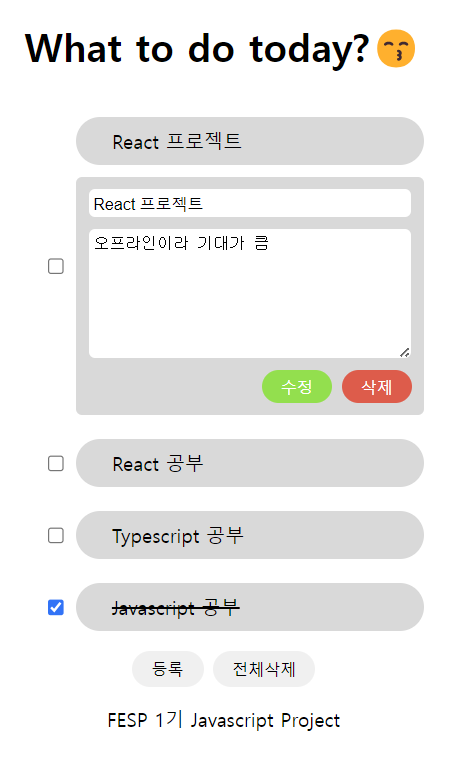
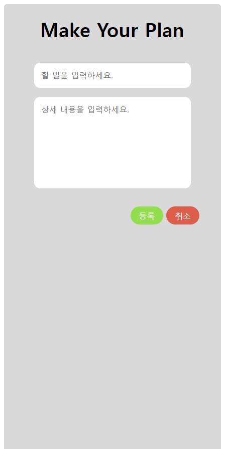

# 🦁 멋쟁이 사자처럼 Front-End School Plus 1기: 미니 프로젝트(TODO List)

> **[기존 프로젝트](https://github.com/FESP01-TodoApp-Project10/FESP01-TodoApp-Project10.git)** <br />  
> **최종 프로젝트: [정소이](https://github.com/uniS2)** <br/> **개발기간: 2023.11.16**

> 🐼 **GitHub URL**: [FESP01-TodoList-Me](주소) <br>

> 🎨 **디자인 시안** : [Figma 시안/UI](주소) <br>

<br>

## 목표 🎯

- 1일 동안 상태 관리 라이브러리를 사용하여 나만의 투두리스트를 만들자!
-

<br>

## 프로젝트 소개

- 기존 TypeScript + React 작업을 상태 관리 라이브러리를 사용하여 최종 나만의 Todo List 프로젝트로 만드는 작업입니다.

- 프로젝트 소개 내용

<br>

## 시작 가이드

### 개발 서버 실행 💻

- 프로젝트 루트에서 실행

```
$ cd 03.react
$ npm start
```

- 출력된 접속 정보 확인해서 개발 서버 접속
  - 기본 포트는 5173으로 구동되고 해당 포트가 사용중일 경우 번호가 하나씩 증가
  - http://localhost:5173/
- HMR (Hot Module Replacement) 지원됨

### api 서버 구동 🌐

- 프로젝트 루트에서 실행

```
$ cd 03.javascript/api
$ npm i
$ npm start
```

- api 서버 사용방법: http://localhost:33088/apidocs

<br>

## Stacks 🐈

### Environment


### Config


### Development


 <br>


### Communication


<br>

## 화면 구성 📺

|       메인 페이지       |           등록 페이지           |
| :---------------------: | :-----------------------------: |
|  |  |

<br>

## 주요 기능 ⚙️

### 1. 메인페이지

- todolist 조회
- todolist 완료/미완료 체크
- todolist 수정
- todolist 삭제
- todolist 전체삭제

### 2. 등록페이지

- todolist 생성

<br>

## 아키텍처

## 디렉토리 구조 📂

```
📦src
 ┣ 📂API
 ┃ ┗ 📜axios.ts
 ┣ 📂component
 ┃ ┣ 📂common
 ┃ ┃ ┣ 📜Footer.tsx
 ┃ ┃ ┗ 📜Header.tsx
 ┃ ┗ 📂updatePage
 ┃ ┃ ┗ 📜TodoUpdate.tsx
 ┣ 📂pages
 ┃ ┣ 📂errorPage
 ┃ ┃ ┗ 📜Error404.tsx
 ┃ ┣ 📂mainPage
 ┃ ┃ ┗ 📜TodoListMain.tsx
 ┃ ┣ 📂registPage
 ┃ ┃ ┣ 📜TodoRegist.tsx
 ┃ ┃ ┗ 📜TodoRegistSettings.ts
 ┃ ┣ 📜RootLayout.tsx
 ┃ ┗ 📜Router.tsx
 ┣ 📜App.tsx
 ┣ 📜index.tsx
 ┣ 📜react-app-env.d.ts
 ┣ 📜reportWebVitals.ts
 ┣ 📜setupTests.ts
 ┗ 📜todoapp.d.ts
```

<br>

[⬆️ 상단으로 이동](#10조-🦁-멋쟁이-사자처럼-front-end-school-plus-1기-미니-프로젝트todo-app)
